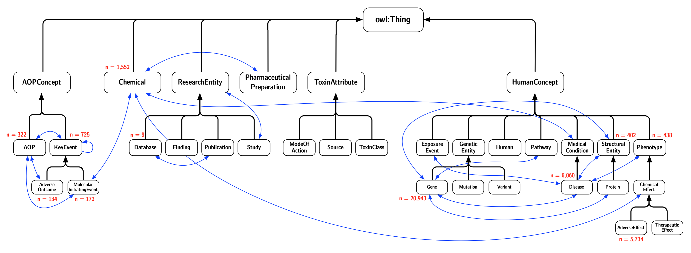

# `ComptoxAI`


A modern biocomputing infrastructure for computational toxicology.

- - -

`ComptoxAI` is a collection of resources made to enable a diverse range of artificial intelligence applications for computational toxicology data.

`ComptoxAI` is developed by [Joseph D. Romano, PhD](http://jdr.bio), who is currently a member of the [Computational Genetics Laboratory](http://epistasis.org) at the University of Pennsylvania, as well as a postdoctoral fellow in the [Center for Excellence in Environmental Toxicology](http://ceet.upenn.edu/).

- - -

## Main components of `ComptoxAI`


_(Counts current as of September 23, 2019)_

### Comptox Ontology

The Comptox Ontology provides a formal description of a wide array of conceptual entities involved in computational toxicology. Specifically, it is meant to support translational research in computational toxicology by defining and enumerating the relationships that occur between these entities.

Two ontologies are included in the repository:

- `comptox.rdf`: The core ontology, consisting of a class polyhierarchy and a definition of object/data properties and their domains/ranges.

- `comptox_populated.rdf`: The same ontology, but populated with individuals for all currently supported classes.

`comptox.rdf` was created by manually building a class hierarchy and properties in the Protégé ontology editor. `comptox_populated.rdf` was created by running the Python scripts in `comptox_ai/scripts/build/`, which parse the core ontology, place individuals sourced from external data resources, attach data properties, and link entities using object properties.

### ComptoxAI graph database

The graph database itself isn't distributed in flat files or database dumps. Instead, the full ontology file (`comptox_populated.rdf`) is imported using the external library NSMNTX (fomally NeoSemantics), which populates Neo4j databases with RDF triples.

### Adverse Outcome Pathway toolbox (PLANNED)

Adverse Outcome Pathways (AOPs) provide a conceptual framework for describing toxic exposures and the ways in which they result in downstream effects. An AOP consists of a Molecular Initiating Event (MIE) and an Adverse Outcome (AO), linked by one or more Key Events (KEs; MIEs happen to be a particular type of KE) organized as a directed acyclic graph (DAG). Some important properties of AOPs:

- KEs can exist at different levels of organization (e.g., molecules, cells, tissues, organisms)
- MIEs, KEs, and AOs can be shared among multiple AOPs
- AOPs fit naturally into both the Comptox Ontology and ComptoxAI's graph database, since the ontology has `AOP`, `KeyEvent`, `MolecularInitiatingEvent`, and `AdverseOutcome` classes that are populated in the database using various external resources

### Machine learning model library (PLANNED)

One of the ultimate goals of ComptoxAI is to enable training advanced machine learning (ML) and deep learning (DL) models that can identify patterns and lead to new discoveries from existing computational toxicology data. A few of our areas of emphasis include:
- Graph convolutional neural networks (Graph CNNs)
- Transformations of the graph data that leverage heterogeneity of the multiple connected node types within the database
- Autoencoder models to reduce dimensionality of computational toxicology data
- Pytorch and/or Tensorflow implementations of these models

### Web learning resources and interactive tools (PLANNED)

In the future, we hope to create interactive visualizations and discovery tools that make it easier for toxicologists to interact with the data in ComptoxAI and the hypotheses that it enables.

- - -

## Installing `ComptoxAI`

- - -

## Planned features (an incomplete list)

- Simple import/export integration between Neo4j and OWL
- Support for feature vectors on ontology individuals (for graph machine learning applications)

- - -

## External data sources

When data types are defined multiple times below, I try to merge them in the best way possible. At some point I will clearly enumerate the procedures used to merge equivalent data elements from multiple sources.

- [Hetionet](het.io) (v1.0, with minor tweaks for compatibility reasons)
  - Adverse effects ('side effects' in hetionet)
  - Chemicals ('compounds' in hetionet)
  - Diseases
  - Genes
  - Phenotype ('symptom' in hetionet)
  - StructuralEntity ('anatomy' in hetionet)
- [CTD](ctdbase.org)
  - Chemicals
  - Pathways
  - Diseases
  - Exposure studies
  - Genes
  - Phenotypes (CTD considers GO terms to be phenotypes---this will have to be reconsidered)
- [TOXLINE](https://toxnet.nlm.nih.gov/newtoxnet/toxline.htm)
  - Toxicology literature, including exposure studies and chemical safety reports
- [TRI (Toxic Release Inventory)](https://toxnet.nlm.nih.gov/newtoxnet/tri.htm)
  - Records documenting environmental releases of toxic chemicals from US factories
- [DSSTox](https://comptox.epa.gov/dashboard)
  - Chemicals
  - Product/Use Categories (i.e., a utilitarian type of chemical classification)
  - Assay (labeled as "Assay/Gene" because genes are often the assay endpoint)

- - -

## How to import the ontology into Neo4j:

1. Install Neo4j and switch to a new (empty) graph database
2. [Install the NSMNTX plugin](http://jbarrasa.github.io/neosemantics/#Install)
3. From the Neo4j browser or Cypher shell, import the RDF file:
```
CALL semantics.importRDF("file:///path/to/ontology/comptox_populated.rdf", "RDF/XML");
```

- - -

## Example Neo4j queries

Shortest path between a molecular initiating event and a resulting disease:
```
MATCH
	(d:ns0__Disease {ns0__commonName: 'Parkinsonian Disorders'}),
	(m:ns0__MolecularInitiatingEvent {ns0__keyEventID: "Event:888"}),
	p=shortestPath((d)-[*]-(m))
WHERE length(p)>1
RETURN p;
```